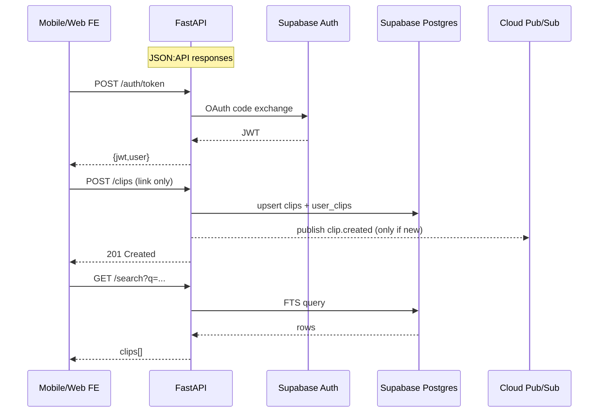

# LLD Public API

**LOW-LEVEL DESIGN – Public API (LLD-PublicAPI-v1)**

---

### 1. **Component Overview**

| Item | Details |
| --- | --- |
| **Goal** | Expose every external HTTPS request for ClipVault MVP: authentication, link ingestion, search, collections, digest preferences. |
| **Scope** | Python 3.12 **FastAPI** application containerised & deployed to Cloud Run (min = 0, max = 20). |
| **Out-of-Scope** | Background AI workers, Admin UI, future screenshot upload endpoint, rate-limiting enforcement. |
| **Stakeholders** | Front-end team, Product, DevOps/SRE, Security. |

---

### 2. **Responsibilities & Interactions**



---

### 3. **Public Interfaces / APIs**

| Method | Path | Auth | Body / Params | Success (200/201) | Error Codes |
| --- | --- | --- | --- | --- | --- |
| POST | `/auth/token` | None | `{provider, code}` | `{jwt,user}` | 401 invalid-code |
| GET | `/me` | JWT | — | `{user}` | 401 |
| POST | `/clips` | JWT | `{source_url, media_type:"link"}` | `{clip_id,status:"queued"}` | 400 malformed URL · 409 duplicate |
| GET | `/clips/{clip_id}` | JWT | — | `{clip, tags, saved_at}` | 404 |
| GET | `/search` | JWT | `q` | `{clips[]}` | 422 |
| POST | `/collections` | JWT | `{name, rule_json?}` | `{coll_id}` | 400 |
| PATCH | `/collections/{id}` | JWT | `{name?, rule_json?}` | `{collection}` | 404 |
| POST | `/collections/{id}/clips` | JWT | `{clip_id}` | 204 | 404 |
| DELETE | `/collections/{id}/clips/{clip_id}` | JWT | — | 204 | 404 |
| GET | `/digest/preview` | JWT | — | `{html}` | 404 empty |
| POST | `/digest/subscribe` | JWT | `{cadence:"weekly" | "daily"}` | 204 |

All endpoints return ISO-8601 timestamps, camelCase property names, and are documented via FastAPI-generated Swagger UI.

---

### 4. **Data Model & Storage**

| Table | PK / Uniques | Purpose |
| --- | --- | --- |
| **clips** | `clip_id` PK · **UNIQUE(source_url)** | Single canonical record per link. |
| **user_clips** | (`owner_uid`,`clip_id`) PK | Many-to-many join; user save history. |
| **tags** | `tag_id` PK · UNIQUE(name) | Global tag catalogue. |
| **clip_tags** | (`clip_id`,`tag_id`) PK | Tags for each clip. |
| **collections** | `coll_id` PK | User folders / smart rules. |
| **collections_clips** | (`coll_id`,`clip_id`) PK | Mapping of user_clips into collections. |
| **jobs** | `job_id` PK | AI processing status. |

**Indices**

```sql
create index clips_fts_idx on clips using gin
  (to_tsvector('english', coalesce(transcript,'') || ' ' || coalesce(summary,'')));

create index user_clips_uid_saved_idx
  on user_clips (owner_uid, saved_at desc);

```

---

### 5. **Event Flows**

| Event | Payload | Trigger | Consumer |
| --- | --- | --- | --- |
| `clip.created` | `{clip_id, source_url}` | New `clips` row | AI-Worker |
| `clip.processed` | `{clip_id, tags[]}` | AI-Worker finish | Redis tag-cache refresher |
| `digest.send` | `{owner_uid, cadence}` | Digest Scheduler | Email worker |

`clip.created` published **once** per unique link; AI costs deduplicated.

---

### 6. **Internal Modules**

```
api/
 ├─ main.py               # FastAPI factory & lifespan hooks
 ├─ routes/
 │   ├─ auth.py           # /auth/token, /me
 │   ├─ clips.py          # /clips*
 │   ├─ search.py         # /search
 │   └─ collections.py    # /collections*
 ├─ services/
 │   ├─ supabase.py       # typed wrapper, RLS helpers
 │   ├─ pubsub.py         # publish/subscribe
 │   ├─ cache.py          # Redis LRU
 │   └─ digest.py
 ├─ schemas/              # Pydantic models
 └─ tests/

```

---

### 7. **Algorithms / Logic (Key Snippets)**

**Clip Ingest**

```python
async def ingest(url: str, uid: UUID):
    clip_id, is_new = await db.upsert_clip(url)
    await db.link_user_clip(uid, clip_id)
    if is_new:
        await pubsub.publish("clip.created", {"clip_id": clip_id, "source_url": url})
    return clip_id

```

**Search** (keyword & tag)

```sql
SELECT c.*, uc.saved_at
FROM clips c
JOIN user_clips uc ON uc.clip_id = c.clip_id
WHERE uc.owner_uid = :uid
  AND to_tsvector('english', c.transcript || ' ' || c.summary) @@ plainto_tsquery(:q)
ORDER BY uc.saved_at DESC
LIMIT 40;

```

---

### 8. **State Management & Caching**

| Cache | Key Pattern | TTL | Refresh Strategy |
| --- | --- | --- | --- |
| Hot tags | `tags:top50` | 10 min | Invalidate on `clip.processed` |
| Clip details | `clip:{clip_id}` | 1 h | Lazy-delete on update (rare in MVP) |

---

### 9. **Security & Compliance**

- Supabase JWT validated via JWKS; RLS enforces `owner_uid`.
- Uploads disabled in MVP, eliminating large-file attack surface.
- Transport: HTTPS + HSTS.
- Secrets in GCP Secret Manager with Workload Identity.
- Data stored in Supabase US region for beta; future India migration documented.

---

### 10. **Observability**

| Signal | Tool & Metric | Alert Threshold |
| --- | --- | --- |
| Latency | Cloud Monitoring `api_latency_ms{route}` | P95 > 800 ms 5 min |
| Error rate | `5xx_rate` | >2 % 5 min |
| Ingest dedupe | `ingest_409_count` | Spike >1 % saves |

Logs are structured JSON (`trace_id` correlated), traces auto-instrumented via OpenTelemetry.

---

### 11. **Performance & Scalability**

- Cloud Run instance: 0.5 vCPU, 512 MB RAM; scales to 20 instances (≈300 QPS).
- Cold-start target < 1.5 s (Python PGO build).
- DB pooled via `asyncpg` (max = 20 conns/instance).
- Initial capacity: 1 k clips/day, headroom ×10 with vertical/ horizontal scale.

---

### 12. **Failure Modes & Resilience**

| Scenario | Impact | Handling |
| --- | --- | --- |
| Supabase outage | 503 | Cloud Run health fails; FE falls back to offline cache |
| Pub/Sub publish fail | Job not queued | Cloud Tasks retry, DLQ |
| JWT expired | 401 | FE refreshes via Auth SDK |

---

### 13. **Migration / Versioning**

- Schema managed by **Sqitch** (git-tagged).
- API version header `X-Api-Version: 2025-07-v1`; breaking changes bump minor path (`/v2`).
- Blue-green deploy (10 % traffic canary) with automated smoke tests.

---

### 14. **Testing Strategy**

| Layer | Tool | Goal |
| --- | --- | --- |
| Unit | Pytest, Hypothesis | ≥80 % lines |
| Contract | Schemathesis | 100 % endpoints |
| Integration | Testcontainers (Supabase local) | CRUD & RLS |
| E2E | Playwright (staging) | Ingest → Search happy path |
| Load | k6 | 100 QPS sustained, error <1 % |

---

### 15. **Open Questions**

*None – all outstanding items resolved for MVP scope.*

---

**Awaiting: (Approve LLD-PublicAPI-v1 | Minor Feedback)**